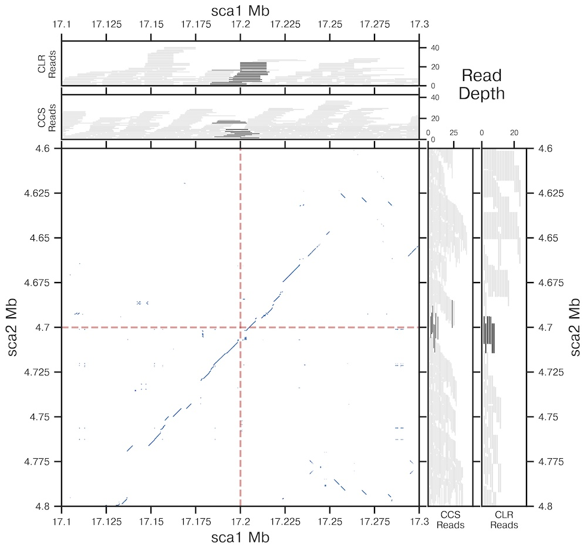

# DPGB
dotplot + genome browser figure generator for genome assembly

Makes plots that look like this:

Read the config file to learn how to use it. Just needs two bam files and a reference genome.
